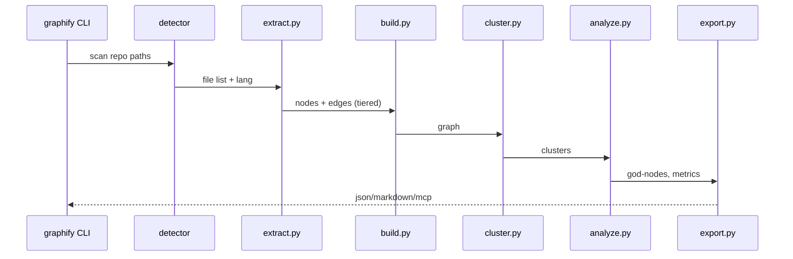

# Phase 02 — Dissect Core Source

## Context Links
- Plan: [plan.md](./plan.md)
- Prev: [phase-01-setup-and-environment.md](./phase-01-setup-and-environment.md)
- Upstream package map: `extract.py` (117KB), `__main__.py` (36KB), `export.py` (39KB), `analyze.py` (21KB), `serve.py` (15KB), `cache.py` (5KB), `cluster.py` (5KB), `benchmark.py` (5KB).

## Overview
- **Date**: 2026-04-14 → 2026-04-16
- **Priority**: P1
- **Status**: pending
- **Review**: cuối Week 1
- **Description**: Đọc source graphify, viết `docs/graphify-internals.md` tiếng Việt mô tả pipeline, schema node/edge, extractor pattern, MCP protocol, caching.

## Key Insights
- Pipeline: detect → extract → build → cluster → analyze → report → export.
- Edge tiers: `EXTRACTED | INFERRED | AMBIGUOUS` — quan trọng cho precision claims.
- `extract.py` chứa nhiều tree-sitter extractors (TS/Py/Go...) — coverage không đều.
- `cluster.py` dùng Leiden algorithm → cần note dependency `igraph`/`leidenalg`.
- `serve.py` expose MCP server → cần hiểu protocol để demo Phase 6.

## Requirements
**Functional**
- Doc mô tả đầy đủ 7 bước pipeline + data flow.
- Có Mermaid sequence diagram.
- Có schema node/edge dạng bảng.
- Có danh sách ngôn ngữ hỗ trợ + limits.

## Architecture

## Related Code Files
**Đọc (upstream `graphifyy/`)**
- `__main__.py` — CLI args, subcommands
- `extract.py` — tree-sitter extractors, node/edge tiers
- `build.py` — graph construction
- `cache.py` — SHA256 content hashing, invalidation
- `cluster.py` — Leiden clustering
- `analyze.py` — god-nodes, centrality
- `serve.py` — MCP server surface
- `export.py` — output formats

**Tạo**
- `docs/graphify-internals.md` (tiếng Việt, ≤ 600 dòng)
- `docs/diagrams/` (Mermaid nếu tách)

## Implementation Steps
1. Đọc `__main__.py` → liệt kê tất cả subcommands + flags.
2. Đọc `cache.py` → hiểu cache key, TTL, invalidation.
3. Đọc `extract.py` top-down: common interface → per-language extractor. Note ngôn ngữ nào complete/partial.
4. Đọc `build.py` → graph data structure (dict? networkx? custom?).
5. Đọc `cluster.py` → thuật toán, params, output format.
6. Đọc `analyze.py` → metrics: centrality, god-node threshold.
7. Đọc `serve.py` → MCP tools expose (query, path, explain, find_refs...).
8. Đọc `export.py` → các format (json/markdown/graphviz/...).
9. Viết `docs/graphify-internals.md` với sections: Overview, Pipeline, Node/Edge Schema, Extractors & Limits, Caching, Clustering, MCP Protocol, Export Formats.
10. Cross-reference các file number/line của upstream.

## Todo
- [ ] Read `__main__.py` + note subcommands
- [ ] Read `cache.py` + document cache strategy
- [ ] Read `extract.py` + map extractor pattern
- [ ] Read `build.py`, `cluster.py`, `analyze.py`
- [ ] Read `serve.py` + MCP tool signatures
- [ ] Read `export.py` formats
- [ ] Viết `docs/graphify-internals.md`
- [ ] Thêm Mermaid sequence diagram
- [ ] Review nội bộ — check VN grammar + tech accuracy

## Success Criteria
- `docs/graphify-internals.md` ≥ 400 dòng, có Mermaid diagram.
- Document mô tả chính xác 7 pipeline stages.
- Liệt kê ≥ 5 ngôn ngữ hỗ trợ + trạng thái coverage.
- Không có placeholder "TODO" trong doc cuối.

## Risk Assessment
| Risk | Mitigation |
|------|-----------|
| `extract.py` quá lớn (117KB) → mất nhiều thời gian | Chia theo ngôn ngữ, focus TS/Py trước |
| Hiểu sai MCP protocol | Chạy `graphify serve` local, inspect actual tool listing |
| Doc drift khi upstream update | Pin commit SHA khi reference |

## Security Considerations
- Chỉ read-only upstream, không fork/modify.
- Không expose API keys trong ví dụ.

## Next Steps
→ Phase 03: chọn 3 benchmark repos + viết task suite.
